[繁體中文](#下載)<br>
<br>
# Download
[Release Page](https://github.com/OOOHA/Wake/releases)&ensp;&ensp;
[Download the Mac version](https://github.com/OOOHA/Wake/releases/download/V1/wake.zip)&ensp;&ensp;
[Download the Windows version](https://github.com/OOOHA/Wake/releases/download/V1/wake.exe)

# How to use it

## Mac version:
[Download](https://github.com/OOOHA/Wake/releases/download/V1/wake.zip)

> [!Note]  
> The file is downloaded as a ```zip``` file, please unzip it first.


### Run the App
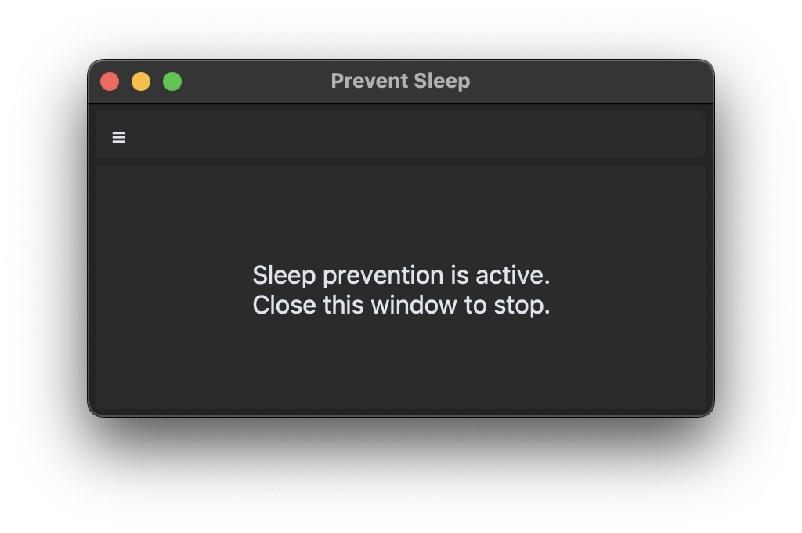

This is the main screen of the App.


> [!Tip]
> Way to close the app:
> * The Red dot
> * Quit the app.
> * Use ```command + Q``` to quit the app.

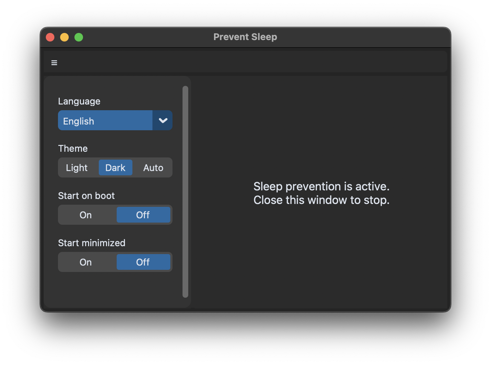

App Settings

Multi Languages
<table align="center">
  <tr>
    <td align="center">
      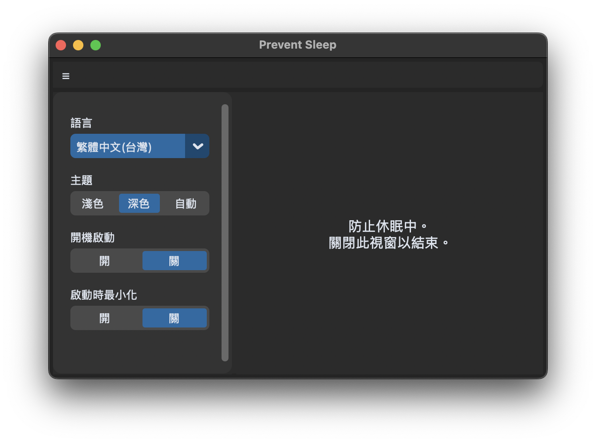<br>
    </td>
    <td align="center">
      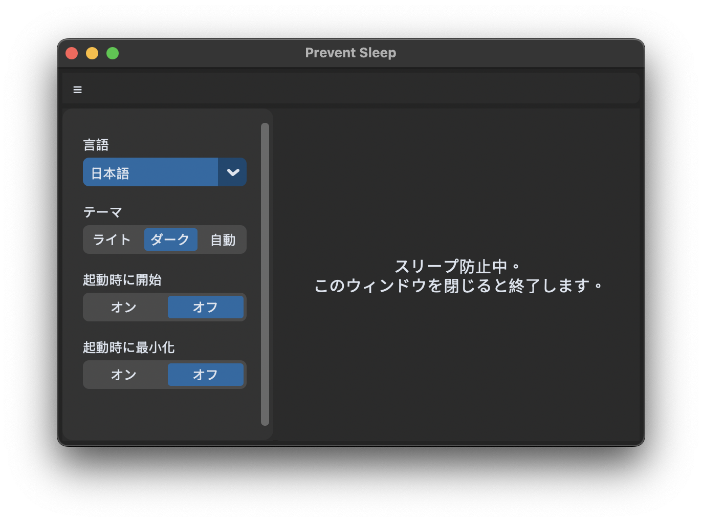<br>
    </td>
  </tr>
</table>

And more languages in the settings.

> [!Note]
> By default, the language will follow the system setting.

## Settings option
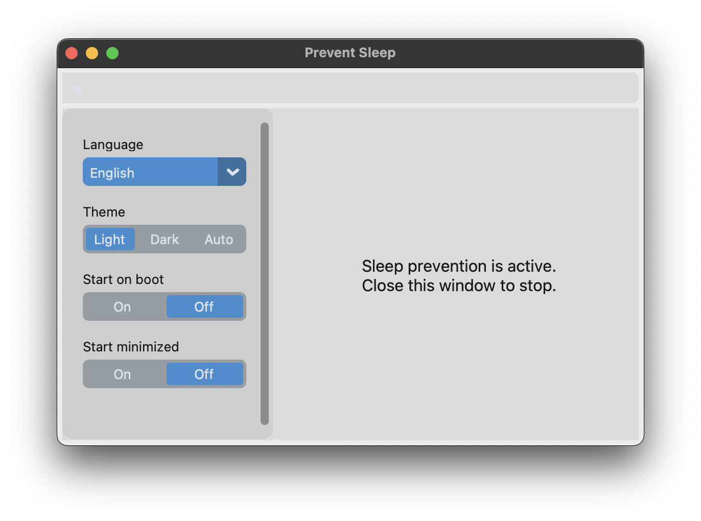

You can choose the theme you like.

> [!Note]
> Auto means the theme will follow the system setting.

## First time launching the App.


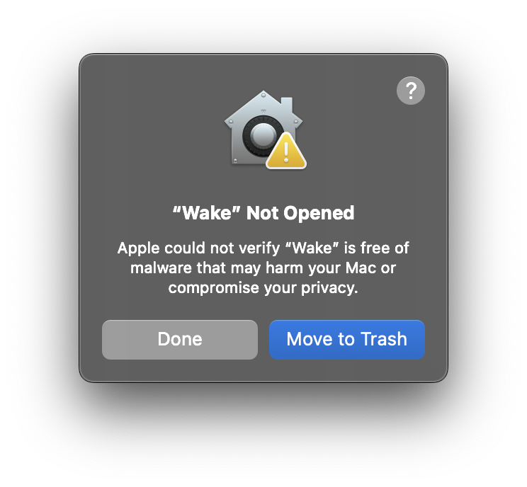

<p>Click Done when seeing this popup</p>
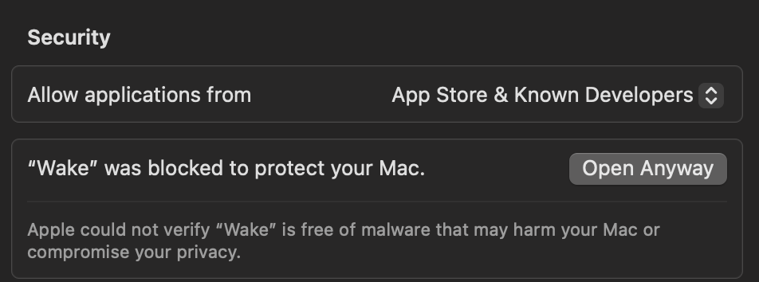

Open System Settings -> Privacy & Security -> Open Anyway

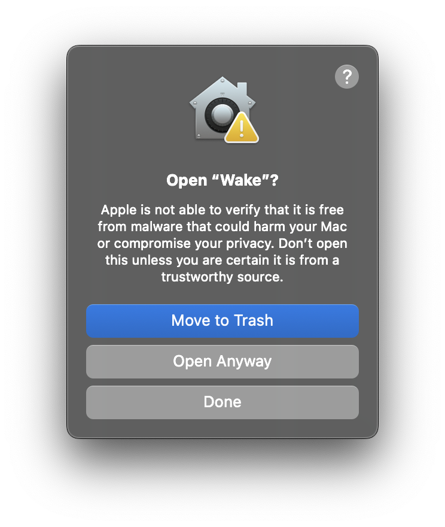

Click Open Anyway

> I promise this is safe.

Click OK and go to System Settings -> Privacy and Security


## Windows version:
[Download](https://github.com/OOOHA/Wake/releases/download/V1/wake.exe)


img src="img/macsc/main.png" alt="image" width="300">

This is the main screen of the App.


> [!Tip]
> Way to close the app:
> * The Red dot
> * Quit the app.
> * Use ```command + Q``` to quit the app.

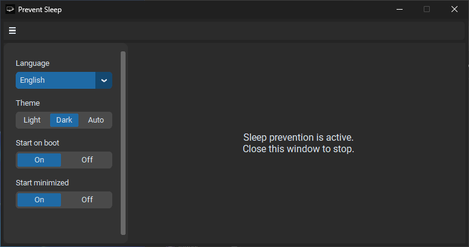

App Settings

Multi Languages
<table align="center">
  <tr>
    <td align="center">
      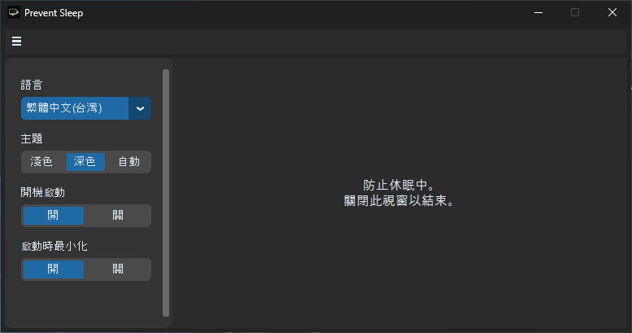<br>
    </td>
    <td align="center">
      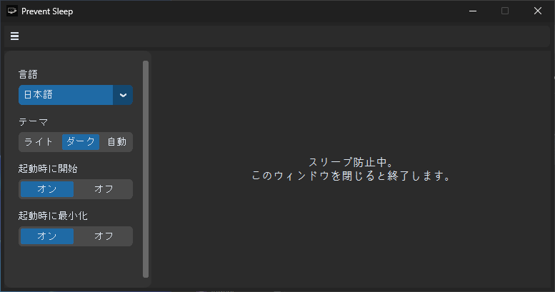<br>
    </td>
  </tr>
</table>

And more languages in the settings.

> [!Note]
> By default, the language will follow the system setting.

## Settings option
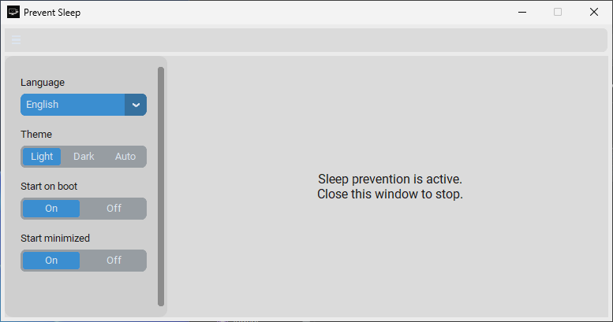

You can choose the theme you like.

> [!Note]
> Auto means the theme will follow the system setting.


---
---
# 下載
[發布頁](https://github.com/OOOHA/Wake/releases)&ensp;&ensp;
[下載 Mac 版](https://github.com/OOOHA/Wake/releases/download/V1/wake.zip)&ensp;&ensp;
[下載 Windows 版](https://github.com/OOOHA/Wake/releases/download/V1/wake.exe)

# 使用方法

## Mac 版:
[下載](https://github.com/OOOHA/Wake/releases/download/V1/wake.zip)

> [!Note]  
> 如下載後為壓縮檔，請先解壓縮


### 執行程式


點擊 Start preventing sleep


在彈出視窗中點擊OK


現在防睡眠已啟用.<br>
如果要結束防睡眠可以點擊stop Preventing sleep.<br>
或是可以透過以下方法結束程式<br>
* 用Mac本身的結束程式.
* 使用 ```cammand + Q``` 結束程式.


> [!Note]  
> 第一次開啟時須提供權限。


點擊 OK 並前往 系統設定 -> 隱私與安全性


在隱私與安全性頁面中找到該畫面，點擊強制開啟


點擊開啟並輸入密碼或是使用指紋解鎖(TouchID)

## Windows 版:
[下載](https://github.com/OOOHA/Wake/releases/download/V1/wake.exe)

### 執行程式


開啟程式後會看到這個視窗，關閉視窗以結束程式。
